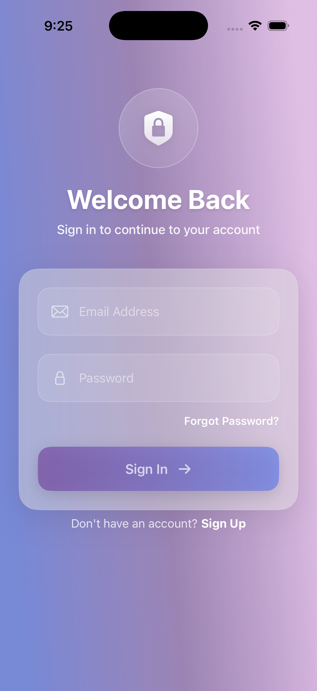
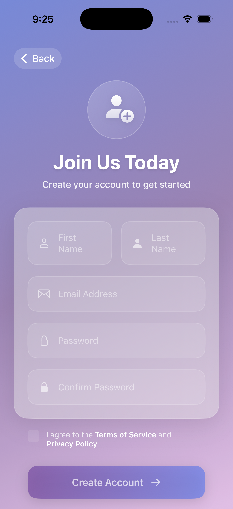
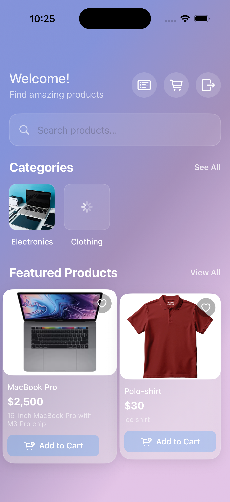
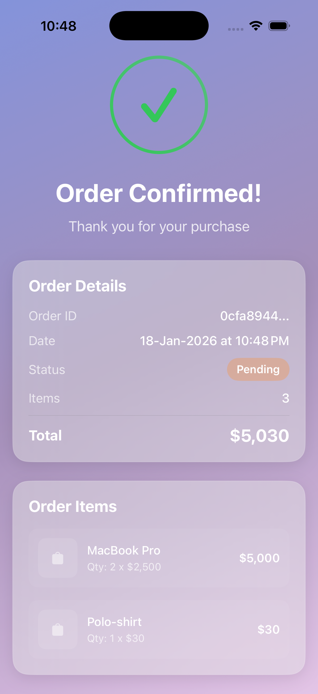

# E-Commerce Full Stack Application

A complete e-commerce platform built with **NestJS** (Backend) and **SwiftUI** (iOS Frontend). This project demonstrates modern full-stack development practices including JWT authentication, input validation, rate limiting, and a clean modular architecture.


---

## Table of Contents

- [Features](#features)
- [Tech Stack](#tech-stack)
- [Project Structure](#project-structure)
- [Backend Architecture](#backend-architecture)
- [API Documentation](#api-documentation)
- [Database Schema](#database-schema)
- [Security Features](#security-features)
- [iOS App Screenshots](#ios-app-screenshots)
- [Getting Started](#getting-started)
- [Environment Variables](#environment-variables)
- [What I Learned](#what-i-learned)

---

## Features

### Backend
- User registration & authentication with JWT
- Password hashing with bcrypt (10 salt rounds)
- Input validation with class-validator decorators
- Rate limiting to prevent brute force attacks
- RESTful API design
- PostgreSQL database with TypeORM
- Environment-based configuration
- Modular architecture (Auth, Users, Products, Categories, Cart, Orders)

### iOS App
- Modern SwiftUI interface with animated gradients
- MVVM architecture
- Async/await networking
- Token-based authentication
- Shopping cart with real-time updates
- Order placement and history
- Pull-to-refresh support

---

## Tech Stack

### Backend
| Technology | Purpose |
|------------|---------|
| NestJS | Node.js framework with TypeScript |
| TypeORM | Database ORM |
| PostgreSQL | Relational database |
| Passport.js | Authentication middleware |
| JWT | Stateless authentication tokens |
| class-validator | DTO validation decorators |
| @nestjs/throttler | Rate limiting |
| bcrypt | Password hashing |

### Frontend
| Technology | Purpose |
|------------|---------|
| SwiftUI | Declarative UI framework |
| Combine | Reactive state management |
| URLSession | Async networking |
| UserDefaults | Token persistence |

---

## Project Structure

```
nestjs-swiftui-ecommerce/
├── e-commerce/                 # NestJS Backend
│   ├── src/
│   │   ├── main.ts            # Entry point + ValidationPipe
│   │   ├── app.module.ts      # Root module + ConfigModule + ThrottlerModule
│   │   ├── auth/              # Authentication module
│   │   │   ├── auth.controller.ts
│   │   │   ├── auth.service.ts
│   │   │   ├── dto/
│   │   │   │   ├── register.dto.ts
│   │   │   │   └── login.dto.ts
│   │   │   ├── guards/
│   │   │   │   ├── jwt-auth.guard.ts
│   │   │   │   └── jwt-role.guard.ts
│   │   │   └── strategies/
│   │   │       └── jwt.strategy.ts
│   │   ├── users/
│   │   │   └── entities/user.entity.ts
│   │   ├── categories/
│   │   │   ├── categories.controller.ts
│   │   │   ├── categories.service.ts
│   │   │   ├── dto/
│   │   │   └── entities/category.entity.ts
│   │   ├── products/
│   │   │   ├── products.controller.ts
│   │   │   ├── products.service.ts
│   │   │   ├── dto/
│   │   │   └── entities/product.entity.ts
│   │   ├── carts/
│   │   │   ├── carts.controller.ts
│   │   │   ├── carts.service.ts
│   │   │   ├── dto/
│   │   │   └── entities/cart.entity.ts
│   │   └── orders/
│   │       ├── orders.controller.ts
│   │       ├── orders.service.ts
│   │       └── entities/order.entity.ts
│   ├── .env.example
│   └── package.json
│
└── swift-nest-e-commerce/      # SwiftUI iOS App
    ├── Services/
    │   ├── ApiService.swift
    │   └── AuthManager.swift
    ├── Models/
    │   ├── AuthModels.swift
    │   ├── CartItem.swift
    │   ├── Categories&products.swift
    │   └── Order.swift
    ├── Auth/
    │   ├── LoginView.swift
    │   └── RegisterView.swift
    ├── Home/
    │   └── HomeView.swift
    ├── Cart/
    │   ├── CartView.swift
    │   ├── CartManager.swift
    │   └── CartButton.swift
    └── Orders/
        ├── OrderConfirmedView.swift
        └── OrdersListView.swift
```

---

## Backend Architecture

### Module System

NestJS uses a modular architecture where each feature is encapsulated in its own module:

```
AppModule (Root)
    ├── ConfigModule      → Environment variables
    ├── ThrottlerModule   → Rate limiting
    ├── TypeOrmModule     → Database connection
    ├── AuthModule        → JWT authentication
    ├── UsersModule       → User entity
    ├── CategoriesModule  → Product categories
    ├── ProductsModule    → Products CRUD
    ├── CartsModule       → Shopping cart
    └── OrdersModule      → Order management
```

### Request Flow

```
Client Request
     │
     ▼
┌─────────────────┐
│  Rate Limiter   │ ← ThrottlerGuard (blocks if too many requests)
└────────┬────────┘
         │
         ▼
┌─────────────────┐
│ ValidationPipe  │ ← Validates DTO, returns 400 if invalid
└────────┬────────┘
         │
         ▼
┌─────────────────┐
│   JWT Guard     │ ← Validates token (protected routes only)
└────────┬────────┘
         │
         ▼
┌─────────────────┐
│   Controller    │ ← Handles HTTP request/response
└────────┬────────┘
         │
         ▼
┌─────────────────┐
│    Service      │ ← Business logic
└────────┬────────┘
         │
         ▼
┌─────────────────┐
│   Repository    │ ← Database operations (TypeORM)
└─────────────────┘
```

### Validation Example

```typescript
// register.dto.ts
export class RegisterDto {
  @IsEmail({}, { message: 'Please provide a valid email address' })
  @IsNotEmpty({ message: 'Email is required' })
  email: string;

  @IsString()
  @MinLength(6, { message: 'Password must be at least 6 characters' })
  @Matches(/^(?=.*[a-z])(?=.*[A-Z])(?=.*\d)/, {
    message: 'Password must contain uppercase, lowercase, and number',
  })
  password: string;

  @IsString()
  @MinLength(2)
  @MaxLength(50)
  firstName: string;

  @IsString()
  @MinLength(2)
  @MaxLength(50)
  lastName: string;
}
```

**Invalid Request:**
```json
POST /auth/register
{ "email": "invalid", "password": "123" }
```

**Response (400 Bad Request):**
```json
{
  "statusCode": 400,
  "message": [
    "Please provide a valid email address",
    "Password must be at least 6 characters",
    "Password must contain uppercase, lowercase, and number",
    "First name is required",
    "Last name is required"
  ],
  "error": "Bad Request"
}
```

---

## API Documentation

### Authentication

| Method | Endpoint | Description | Auth | Rate Limit |
|--------|----------|-------------|------|------------|
| POST | `/auth/register` | Create new user | No | 3/min |
| POST | `/auth/login` | Get JWT token | No | 5/min |
| GET | `/auth/profile` | Get current user | JWT | None |

### Categories

| Method | Endpoint | Description | Auth |
|--------|----------|-------------|------|
| POST | `/categories` | Create category | No |
| GET | `/categories` | List all categories | JWT |
| GET | `/categories/:id` | Get single category | No |
| PATCH | `/categories/:id` | Update category | No |
| DELETE | `/categories/:id` | Delete category | No |

### Products

| Method | Endpoint | Description | Auth |
|--------|----------|-------------|------|
| POST | `/products` | Create product | No |
| GET | `/products` | List all products | JWT |
| GET | `/products/:id` | Get single product | No |
| PATCH | `/products/:id` | Update product | No |
| DELETE | `/products/:id` | Delete product | No |

### Cart

| Method | Endpoint | Description | Auth |
|--------|----------|-------------|------|
| GET | `/carts/my-cart` | Get user's cart | JWT |
| POST | `/carts/add` | Add item to cart | JWT |
| DELETE | `/carts/remove/:productId` | Remove item | JWT |
| DELETE | `/carts/clear` | Clear entire cart | JWT |

### Orders

| Method | Endpoint | Description | Auth |
|--------|----------|-------------|------|
| GET | `/orders` | Get user's orders | JWT |
| GET | `/orders/:id` | Get single order | JWT |
| POST | `/orders` | Create order from cart | JWT |

---

## Database Schema

```
┌─────────────────┐       ┌─────────────────┐
│      USER       │       │    CATEGORY     │
├─────────────────┤       ├─────────────────┤
│ id (UUID) PK    │       │ id (UUID) PK    │
│ email (unique)  │       │ name (unique)   │
│ password (hash) │       │ description     │
│ firstName       │       │ image           │
│ lastName        │       │ createdAt       │
│ role            │       │ updatedAt       │
│ createdAt       │       └────────┬────────┘
│ updatedAt       │                │
└────────┬────────┘                │ OneToMany
         │                         │
         │ OneToOne                ▼
         │                ┌─────────────────┐
         ▼                │    PRODUCT      │
┌─────────────────┐       ├─────────────────┤
│      CART       │       │ id (UUID) PK    │
├─────────────────┤       │ name            │
│ id (UUID) PK    │       │ description     │
│ user_id (FK)    │       │ price (decimal) │
│ items (JSON)    │       │ stock (int)     │
│ total (decimal) │       │ imageUrl        │
│ createdAt       │       │ category_id FK  │
│ updatedAt       │       │ createdAt       │
└─────────────────┘       │ updatedAt       │
                          └─────────────────┘
         │
         │ ManyToOne
         ▼
┌─────────────────┐
│     ORDER       │
├─────────────────┤
│ id (UUID) PK    │
│ user_id (FK)    │
│ items (JSON)    │
│ total (decimal) │
│ status          │
│ createdAt       │
└─────────────────┘
```

### Cart & Order Items (JSON Structure)

```json
{
  "items": [
    {
      "productId": "uuid",
      "productName": "iPhone 15",
      "quantity": 2,
      "price": "999.99"
    }
  ]
}
```

> **Design Decision:** Items are stored as JSON snapshots, not foreign keys. This preserves the product name and price at the time of purchase, even if the product is later modified or deleted.

---

## Security Features

### 1. Password Hashing

```typescript
// user.entity.ts
@BeforeInsert()
async hashPassword() {
  this.password = await bcrypt.hash(this.password, 10);
}
```

Passwords are hashed with bcrypt (10 salt rounds) before storage. Original passwords are never stored.

### 2. JWT Authentication

```
┌──────────┐     Login      ┌──────────┐
│  Client  │ ──────────────▶│  Server  │
└──────────┘  email/pass    └──────────┘
                                  │
                                  │ Validate credentials
                                  │ Generate JWT
                                  ▼
┌──────────┐    Token       ┌──────────┐
│  Client  │ ◀──────────────│  Server  │
└──────────┘                └──────────┘
      │
      │ Store token
      │
      ▼
┌──────────┐   Protected    ┌──────────┐
│  Client  │ ──────────────▶│  Server  │
└──────────┘ Authorization: └──────────┘
             Bearer <token>       │
                                  │ Validate token
                                  │ Extract user info
                                  ▼
                            Allow/Deny
```

### 3. Rate Limiting

```typescript
// Global limits (all routes)
ThrottlerModule.forRoot([
  { ttl: 1000, limit: 3 },     // 3 requests/second
  { ttl: 10000, limit: 20 },   // 20 requests/10 seconds
  { ttl: 60000, limit: 100 },  // 100 requests/minute
])

// Specific endpoint limits
@Throttle({ default: { ttl: 60000, limit: 5 } })  // 5 login attempts/min
async login() { }
```

**When limit exceeded:**
```json
{
  "statusCode": 429,
  "message": "ThrottlerException: Too Many Requests"
}
```

### 4. Input Validation

All incoming data is validated before processing:

| Decorator | Validates |
|-----------|-----------|
| `@IsEmail()` | Valid email format |
| `@IsNotEmpty()` | Not empty |
| `@MinLength(n)` | Minimum characters |
| `@MaxLength(n)` | Maximum characters |
| `@IsNumber()` | Numeric value |
| `@Min(n)` | Minimum value |
| `@IsUUID()` | Valid UUID |
| `@IsUrl()` | Valid URL |
| `@Matches(regex)` | Custom pattern |

### 5. Environment Variables

Sensitive data is stored in `.env` (not committed to git):

```env
JWT_SECRET=your-secret-key
DB_PASSWORD=your-db-password
```

---

## iOS App Screenshots

### Authentication

| Login | Register |
|-------|----------|
|  |  |

### Home & Cart

| Home | Cart |
|------|------|
|  |  |

### Orders

| Order Confirmed | Order History |
|-----------------|---------------|
|  |  |

---

## Getting Started

### Prerequisites

- Node.js 18+
- PostgreSQL 14+
- Xcode 15+ (for iOS app)
- macOS (for iOS development)

### Backend Setup

```bash
# Navigate to backend
cd e-commerce

# Install dependencies
npm install

# Create database
createdb ecommerce

# Copy environment file
cp .env.example .env

# Edit .env with your values
nano .env

# Run development server
npm run start:dev
```

### iOS App Setup

```bash
# Navigate to iOS project
cd swift-nest-e-commerce

# Open in Xcode
open swift-nest-e-commerce.xcodeproj

# Run on simulator (Cmd + R)
```

> **Note:** Update `ApiService.swift` base URL if not using localhost:3000

---

## Environment Variables

Create a `.env` file in the backend directory:

```env
# Server
PORT=3000
NODE_ENV=development

# Database
DB_HOST=localhost
DB_PORT=5432
DB_USERNAME=your_username
DB_PASSWORD=your_password
DB_DATABASE=ecommerce

# JWT
JWT_SECRET=your-secret-key-min-32-characters
JWT_EXPIRES_IN=1d

# Rate Limiting
THROTTLE_TTL=60000
THROTTLE_LIMIT=100
```

Generate a secure JWT secret:
```bash
node -e "console.log(require('crypto').randomBytes(32).toString('hex'))"
```

---

## What I Learned

### Backend Development

- **NestJS Architecture** - Modules, Controllers, Services, and Dependency Injection
- **TypeORM** - Entity definitions, relationships (OneToMany, ManyToOne, OneToOne)
- **Authentication** - JWT tokens, Passport strategies, Guards
- **Validation** - class-validator decorators, ValidationPipe configuration
- **Security** - Password hashing, rate limiting, environment variables
- **API Design** - RESTful endpoints, proper HTTP status codes

### iOS Development

- **SwiftUI** - Declarative UI, state management with @Published
- **MVVM Pattern** - Separation of concerns
- **Async/Await** - Modern Swift concurrency
- **Networking** - URLSession, JSON encoding/decoding

### Full Stack Concepts

- **Client-Server Communication** - HTTP methods, headers, JSON payloads
- **Authentication Flow** - Token storage, protected routes
- **Error Handling** - Validation errors, network errors, user feedback

---

## Future Improvements

- [ ] Add refresh tokens
- [ ] Implement admin dashboard
- [ ] Add product search & filtering
- [ ] Unit & E2E tests
- [ ] Docker containerization


---

## License

This project is for educational purposes.

---

<p align="center">
  Built with NestJS + SwiftUI
</p>
